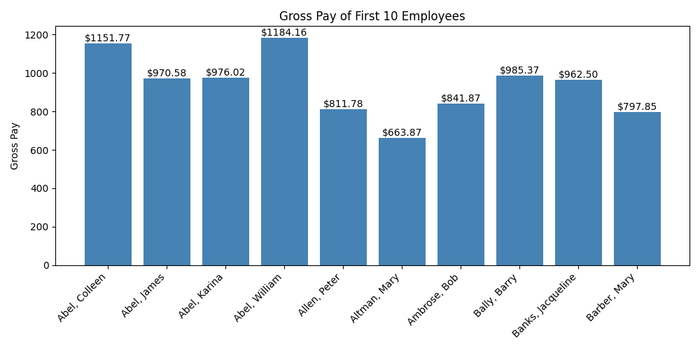
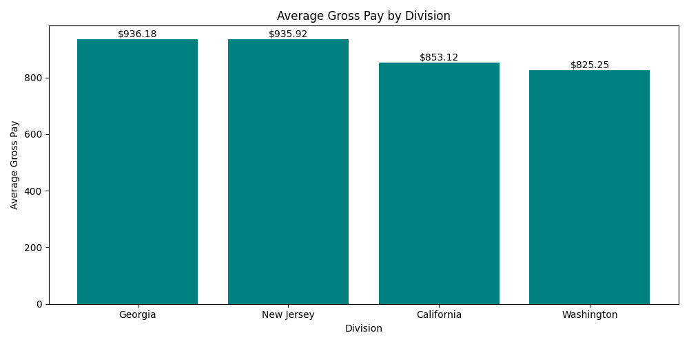
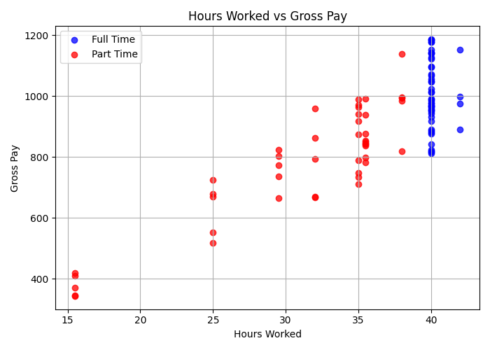
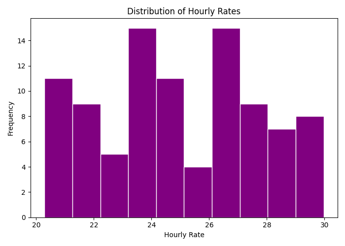
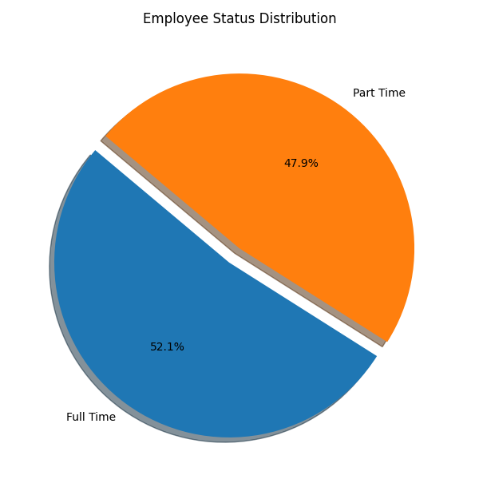
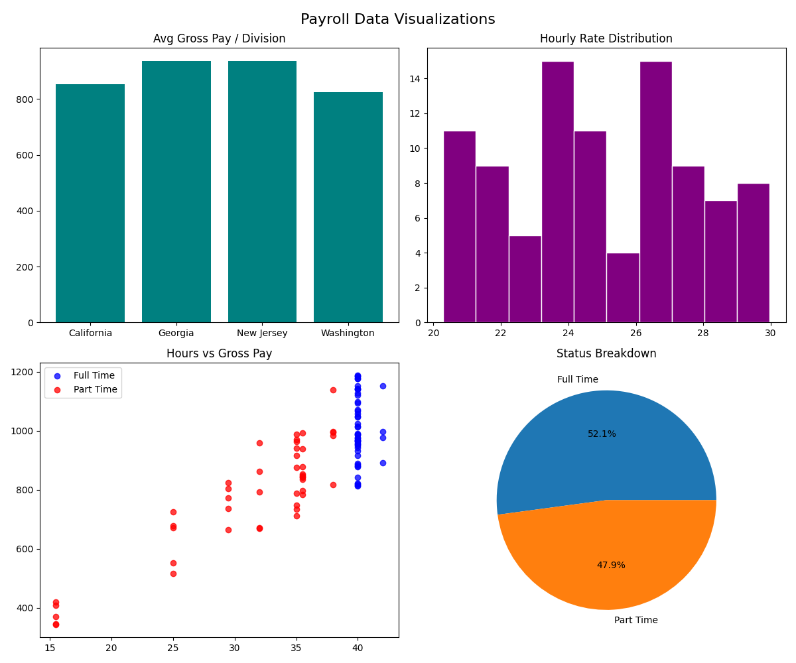
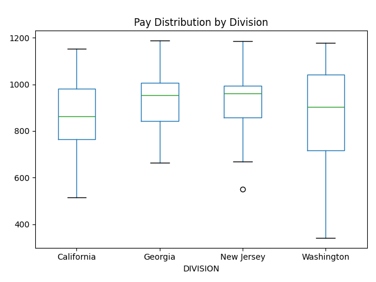
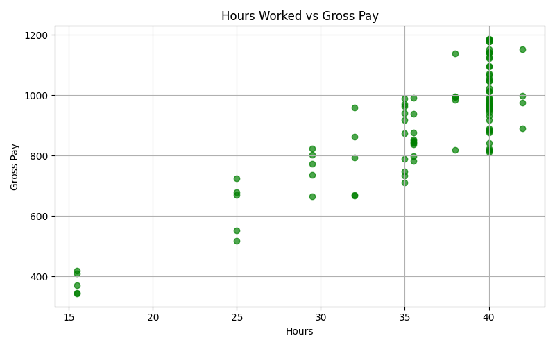
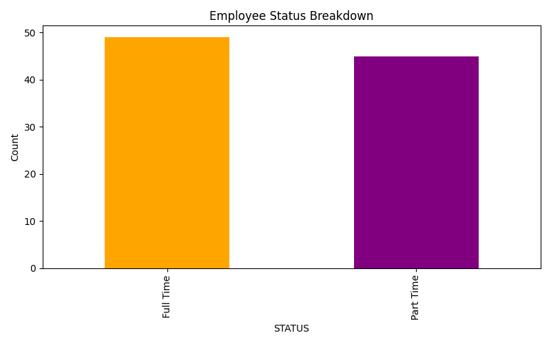

# Payroll Data Visualizations

This project performs a complete visual analysis of a payroll dataset using **Matplotlib** and **Pandas**.
Each task includes a description, explanation, and the generated plot image.

---

## ## Part 1 — Gross Pay of First 10 Employees

This bar chart displays the gross pay of the first ten employees in the dataset.

**Task Requirements:**

* X‑axis: Employee names
* Y‑axis: Gross Pay
* Add title and value labels

**Result:**



---

## Part 2 — Average Gross Pay by Division

This visualization groups the dataset by division and computes the average gross pay for each.

**Task Requirements:**

* Bar chart of average gross pay
* Each bar labeled with its value
* Title + axis labels

**Result:**



---

## Part 3 — Hours Worked vs Gross Pay (Scatter Plot)

This scatter plot shows the relationship between hours worked and gross pay, color‑coded by employee status.

**Task Requirements:**

* X‑axis: Hours
* Y‑axis: Gross Pay
* Points colored by status (Full‑Time / Part‑Time)
* Add legend and grid

**Result:**



---

## Part 4 — Histogram of Hourly Rates

This histogram shows how hourly wages are distributed across all employees.

**Task Requirements:**

* 10 bins
* Title + axis labels

**Result:**



---

## Part 5 — Employee Status Pie Chart

Shows the proportion of Full‑Time vs Part‑Time workers.

**Task Requirements:**

* Pie chart with percentages
* Explode the larger slice

**Result:**



---

## Part 6 — Combined 2×2 Subplots

A 2×2 grid of the previous visualizations.

**Task Requirements:**

1. Avg Gross Pay by Division (Bar)
2. Hourly Rates Distribution (Hist)
3. Hours vs Pay (Scatter)
4. Status Distribution (Pie)

**Result:**



---

## Part 7 — Mini Project (Custom Visualizations)

A set of additional analytical plots created using cleaned numeric columns.

### 7.1 — Pay Distribution per Division (Boxplot)

Shows pay spread across divisions.



### 7.2 — Hours vs Pay (Scatter)

A refined scatter showing numerical correlations.



### 7.3 — Employee Status Breakdown (Bar Chart)

Count of workers by employment status.



---

## Code Summary

All data cleaning and visualizations are produced using `da1511.py`, which:

* Loads and normalizes the CSV file
* Cleans numeric columns (removes $, commas, spaces)
* Generates all listed plots and saves them as PNG

You can run everything with:

```bash
python da1511.py
```

All generated images are stored in the project root, as shown in the GitHub file structure.
